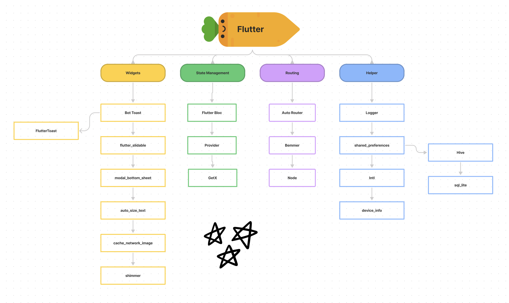

# Todo app

## Prerequisites

- Flutter: >=3.7.0 <4.0.0
- [Firebase staging](https://console.firebase.google.com/u/0/project/flutter-app-ec8dd/settings/iam)
- [Firebase prod](https://console.firebase.google.com/u/0/project/template-app-prod-3a034/settings/iam)

## How to Run

1. Go to project root and execute the following command in console to get the required dependencies:

   ```
   flutter pub get
   ```

2. Now run the generator

   ```
   flutter packages pub run build_runner build
   ```

3. To run staging project

   ```
   flutter run --flavor staging --target lib/main_staging.dart
   ```

4. To run production project

   ```
   flutter run --flavor production --target lib/main_production.dart
   ```

5. Execute the following command to build app:

### Android

1. Change version and build number in `pubspec.yaml`

   ```
   flutter build appbundle
   ```

2. Or run command line below to build with your build version

   ```
   flutter build appbundle --build-name=1.2.0 --build-number=2
   ```

3. Access [Play console](https://play.google.com/console/u/0/developers) to create a new release and upload your build

### iOS

1. Change version and build number in Xcode
2. Access <https://developer.apple.com/> to download profile and signing your app

- **Manually:** Pod install then Open Xcode to deploy

  ```sh
  flutter build ios --release --no-codesign
  cd ios && pod install
  ```

  - Open XCode and deploy
  - On menu bar, select **Product** > **Archive** to build and deploy to TestFlight

- **Use Fastlane:** run command bellow

  ```sh
  cd ios
  fastlane beta
  ```

# Code Conventions

- [analysis_options.yaml](analysis_options.yaml)
- [About code analytics flutter](https://medium.com/flutter-community/effective-code-in-your-flutter-app-from-the-beginning-e597444e1273)

  In Flutter, Modularization will be done at a file level. While building widgets, we have to make sure they stay independent and re-usable as maximum. Ideally, widgets should be easily extractable into an independent project.

- Must know
  - Model name start with `M`: MUser, MProduct, MGroup...
  - Common widget start with `X`: XButton, XText, XAppbar... - There widget under folder `lib/widgets/`
  - App Constants class or service start with `Add`: AppStyles, AppColor, AppRouter, AppCoordinator,.. and UserPrefs

# Dependencies



## Helper

- [logger](https://pub.dev/packages/logger): Small, easy to use and extensible logger which prints beautiful logs.

- [url_launcher](https://pub.dev/packages/url_launcher): A Flutter plugin for launching a URL in the mobile platform. Supports iOS, Android, web, Windows, macOS, and Linux.

- [auto_route](https://pub.dev/packages/auto_route): Auto route generator, Manager router

- [get_it](https://pub.dev/packages/get_it): This is a simple Service Locator

- [intl](https://pub.dev/packages/intl): This package provides internationalization and localization facilities, including message translation, plurals and genders, date/number formatting and parsing, and bidirectional text.

- [shared_preferences](https://pub.dev/packages/shared_preferences): Flutter plugin for reading and writing simple key-value pairs. Wraps NSUserDefaults on iOS and SharedPreferences on Android.

- [package_info_plus](https://pub.dev/packages/package_info_plus): This Flutter plugin provides an API for querying information about an application package.

- [device_info_plus](https://pub.dev/packages/device_info_plus): Get current device information from within the Flutter application.

- [permission_handler](https://pub.dev/packages/permission_handler): Permission plugin for Flutter. This plugin provides a cross-platform (iOS, Android) API to request and check permissions.

## HTTP, API

- [http](https://pub.dev/packages/http): A composable, Future-based library for making HTTP requests.

## Flutter Fire

> The official Firebase plugins for Flutter. sign_in, analytics, crashlytics, storage, firestore

- [Flutter Fire](https://firebase.flutter.dev/)

## State Management

> State Management is still the hottest topic in Flutter Community. There are tons of choices available and it’s super intimidating for a beginner to choose one. Also, all of them have their pros and cons. So, what’s the best approach

**A recommended approach**

- [flutter_bloc](https://pub.dev/packages/flutter_bloc): Widgets that make it easy to integrate blocs and cubits into Flutter. [Learn more](https://bloclibrary.dev/#/)

## Flutter Gen

- [flutter_gen](https://pub.dev/packages/flutter_gen): The Flutter code generator for your assets, fonts, colors, … — Get rid of all String-based APIs.

## Localization

- [localization](https://pub.dev/packages/localization): Package to simplify in-app translation.

## Widget

- [shimmer](https://pub.dev/packages/shimmer): Shimmer loading animation
- [flutter_html](https://pub.dev/packages/flutter_html)
- [webview_flutter](https://pub.dev/packages/webview_flutter)

## Image

- [cached_network_image](https://pub.dev/packages/cached_network_image)
- [flutter_cache_manager](https://pub.dev/packages/flutter_cache_manager)

# Code structure

Here is the core folder structure which flutter provides.

```
flutter-app/
|- android
|- ios
|- web
|- lib
|- modules
|- test
```

Here is the folder structure we have been using in this project

```
lib/
|- packages/
|- src/
  |- data/
  |- services/
  |- feature/
    |- dashboard/
      |- widget/
      |- controller
      |- dashboard_screen.dart
    |- home/
    |- login/
  |- plugins/
  |- routing/
|- widgets/
  |- button/
  |- image/
  |- view/
|- main.dart
|- modules
```
